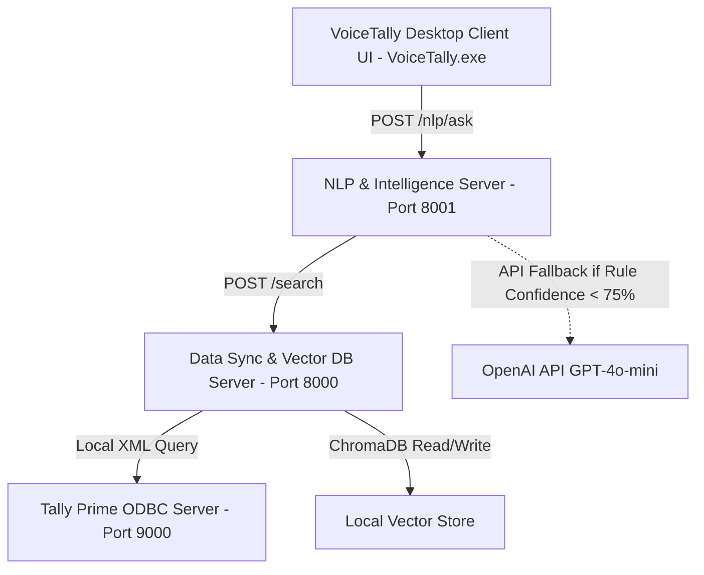

# VoiceTally — Voice-Driven AI Assistant for Tally

VoiceTally is a modern, voice-driven AI assistant and graphical dashboard ecosystem designed for **Tally Prime** and **Tally ERP 9**. It enables accountants, managers, and business owners to search local ledger balances, sales trends, stock items, and daily business summaries in natural language (English, Hindi, or Hinglish) using voice or text.

---

## Easy Installation for Users (Recommended)

To install and run VoiceTally on your Windows PC, you do **not** need to touch any code or configure files manually. Simply download and run the single-click installer:

1. **Prerequisite**: Ensure you have Python 3.9+ installed on your computer.
2. Download and double-click the **[VoiceTallySetup.exe](file:///c:/Users/harsh/Desktop/harshil/programs/tally/VoiceTally/VoiceTallySetup.exe)** installer.
3. The setup wizard will guide you through directory selection and prompt you for configuration:
   * **Tally Company Name**: (Recommended) The exact name of your active company in Tally (e.g., *Demo Company*).
   * **OpenAI API Key**: (Optional but Recommended) Enables advanced, conversational fallback query processing if the local system doesn't match a direct shortcut query.
4. **Complete Setup**: The installer will extract all files, set up local dependencies silently, and launch the assistant.
5. **How to use**: Open Tally Prime, and press **`Ctrl + Shift + V`** from anywhere on your PC to bring up the voice/text search bar!

---

## Technical Architecture Overview

VoiceTally is composed of modular service layers that communicate locally for absolute privacy, low latency, and offline-first capabilities:

### Core Architecture Components:

1. **Desktop Tray Client (`VoiceTally.exe`)**:
   * A standalone GUI written in Python Tkinter. It resides in the Windows System Tray, listens for a global hotkey shortcut (`Ctrl+Shift+V`), captures microphone input using `sounddevice`, and presents parsed outputs.
2. **API Proxy Gateway (`voicetally-proxy.exe`)**:
   * A NodeJS server running on **port 3000** that manages local endpoint requests, rate limiting, and local STT audio transcoding using Hugging Face Whisper.
3. **NLP & Intelligence Server (`app/` on Port 8001)**:
   * A Python FastAPI layer. It runs the hybrid NLP matching logic. It first processes incoming queries using high-speed, local rule-based regex patterns. If the query confidence drops below `0.75`, it falls back to the LLM (OpenAI API) for semantic understanding. It also generates Matplotlib analytics graphs and compiles PDF reports.
4. **Data Sync Server & Vector DB (`extracting_tally_data/` on Port 8000)**:
   * A Python FastAPI service that pulls Master and Voucher data directly from the active Tally instance (listening on port 9000) via XML requests, converts it into ledger transaction records, and builds a searchable semantic index inside a local **Chroma DB** vector store.

---

## ⚙️ Tally Prime Preparation

To allow the VoiceTally app to communicate with Tally:
1. Open Tally Prime.
2. Go to **Gateway of Tally** > **F1: Help** > **Settings** > **Startup**.
3. Set **Enable ODBC Server** to **Yes** and set the **Port** to **`9000`**.
4. Open your TDL Settings (**Help** > **TDLs & Add-ons** > **F4**) and add the path to the TDL launcher script:
   `C:\Users\<YourUsername>\AppData\Local\VoiceTally\tdl-extension\voicetally_nlp.tdl`
   *(Or press Windows key + R, type `%localappdata%\VoiceTally\tdl-extension\voicetally_nlp.tdl` to find the exact location)*

  ***FEW BUGS LEFT TO FIX, WILL RELEASE ONCE FIXED***
