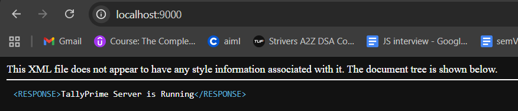

This python script basically extracts the data from your tally and generate a csv for that data

Steps to run this:
    turn on tally prime	
    go to your company
        f1(help)
        settings
        connectivity
            clientserver- server port-9000 odbc- yes 
    restart tally, check localhost://9000-> tally is running
    

   
Additional Setup:
    in config.json->

    {
        "tally": 
        {
            "url": "http://localhost:9000",
            "company_name": "Demo Company"
        },
        "output": 
        {
            "directory": "output"
        }
    }

    change the company_name to the company you want to extract your data from.

now the tally is ready to be hit with the api-> 
    cd <projectfolder> 
    python tally_to_csv.py

once you run the script, itll generate multiple csvs for multiple data domains in the output folder 
1) Day Book-> Contains ALL transactions
Core of accounting

Required for: revenue, expenses, cash flow

2) List of Accounts (Ledgers) 
voucher data alone is meaningless without ledgers, 
Needed to: classify transactions , know customers / vendors ,map expenses

3) List of Groups
Ledgers belong to groups
Groups define:Asset / Liability / Income / Expense

4) Inventory (Stock Items, Units, Stock Groups)

/output/
├── day_book.csv
├── ledgers.csv
├── groups.csv
├── stock_items.csv
├── stock_groups.csv
└── units.csv

Note: The following Headers Can be changed by making changes in the script based on needs.

day_book.csv
    Headers-
        voucher_type,
        voucher_number,
        voucher_date,
        party_ledger,
        ledger_name,
        amount,
        dr_cr,
        narration

ledgers.csv
    Headers-
        ledger_name,
        parent_group,
        opening_balance,
        closing_balance,
        is_billwise_on,
        is_cost_center_on

groups.csv
    Headers-
        group_name,
        parent_group,
        primary_group,
        nature_of_group

stock_items.csv
    Headers-
        stock_item_name,
        stock_group,
        base_unit,
        opening_quantity,
        opening_value,
        gst_hsn_code

stock_groups.csv
    Headers-
        stock_group_name,
        parent_stock_group

units.csv
    Headers-
        unit_name,
        formal_name,
        decimal_places

Note: this is just a script for now.
future changes will include a proper API endpoint 
