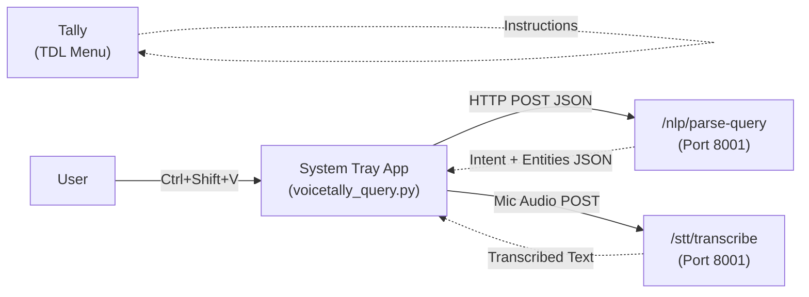

# VoiceTally — NLP Tally Extension

This folder contains the Tally integration for VoiceTally. It provides a natural language interface (text and voice) to query Tally data without navigating through menus.

## Architecture

Due to limitations in Tally's HTTP and external execution capabilities (especially in TallyPrime EDU), the extension operates in two parts:

1. **The Backend (System Tray App)**: `voicetally_query.py` acts as the workhorse. It runs in the background as a system tray app, capturing global hotkeys, recording microphone input, and communicating directly with the Intelligence API.
2. **The Frontend (TDL Menu)**: `voicetally_nlp.tdl` adds a menu item to the Gateway of Tally. This primarily serves as a reminder/instruction panel on how to use the tool.



## Files

| File | Description |
|---|---|
| `voicetally_query.py` | The core Python GUI application. Handles the dark-themed UI, voice recording (`sounddevice`), HTTP requests, and runs as a system tray icon (`pystray`). |
| `launch_voicetally.bat` | A Windows batch script that launches the Python GUI in the background (`pythonw.exe`). This is the intended entry point for users. |
| `voicetally_nlp.tdl` | The TDL (Tally Definition Language) file. Loads a menu item into the Gateway of Tally displaying instructions. |

## Setup Instructions

### 1. Prerequisites
Ensure you have Python 3.x installed, along with the required dependencies. Run the following from the project root:
```bash
# Install core API dependencies
pip install -r requirements.txt

# Install tray app specific dependencies
pip install pystray Pillow keyboard sounddevice soundfile requests
```
> **Note for Voice Input:** `openai-whisper` (used by the backend API) requires `ffmpeg` to be installed on your system.

### 2. Start the Backend Server
The extension requires the Intelligence API to be running on port 8001. From the project root:
```bash
uvicorn app.main:app --port 8001
```

### 3. Load Tally Integration
1. Open TallyPrime.
2. Press **F1** (Help) → **TDL & Add-on** → **F4: Manage Local TDLs**.
3. Browse to and select `tdl-extension/voicetally_nlp.tdl`.
4. Return to the Gateway of Tally to see the new **VoiceTally NLP Query** menu item.

### 4. Run the Tray App
Double-click `launch_voicetally.bat`. 
- A purple **"VT"** icon will appear in your system tray.
- The app will run silently in the background.

## Usage

1. **Trigger the App:** Press exactly **`Ctrl + Shift + V`** from anywhere (even while actively working inside Tally).
2. **Text Query:** Type your query (e.g., *"show sales for last week"*) and click **Send ▶**.
3. **Voice Query:** Click the 🎤 icon, speak for 5 seconds, and let the app auto-transcribe and process your request.
4. **Close:** Click the "X" to close the window. The app will return to the system tray, waiting for your next hotkey press.

## Development

If you need to view raw console output and debug print statements while modifying the GUI, run the python script directly with the `--show` flag instead of using the background batch file:

```bash
python voicetally_query.py --show
```
